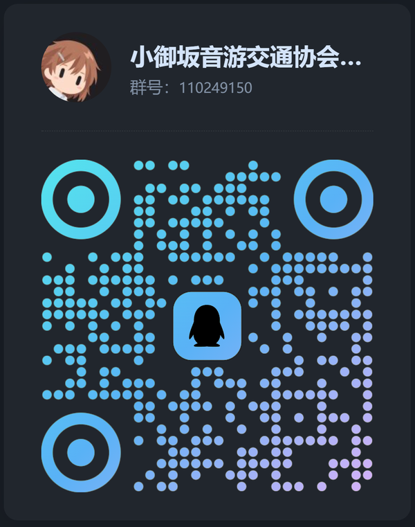
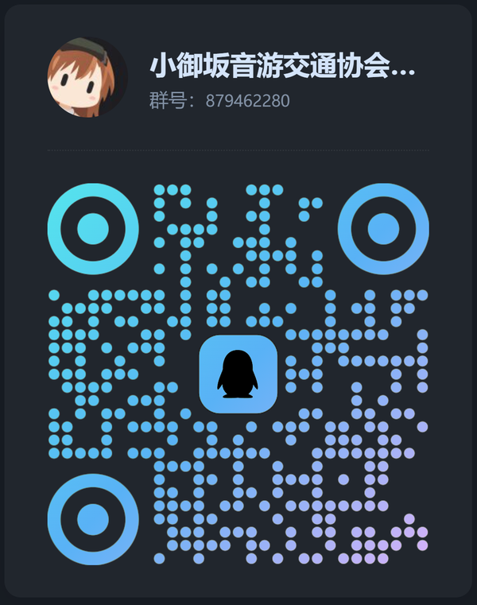

<h1 align='center'>👋 Hello!</h1>

```python
misaka = MisakaMikoto(level=5)
misaka.railgun()
```

# About

大家好这里是小御坂（`MisakaNo`），一位会折腾电子数码和写代码的大学生，想了解更多可以看我的[博客](https://www.misakano.cn/)。

- 大学生
- 音游 & 摄影
- 推御坂美琴

<p align='center'></p>


# Motto

> 想做的事，先做了再说。


# Contact

- **Email:** [misakano@qq.com](mailto:misakano@qq.com)
- **Blog:** [misakano.cn](https://www.misakano.cn/)
- **微信公众号:** 小御坂的避难所

QQ 群（扫码加入）：

<p align='center'>
  
  
</p>

# Program Language (Sort by proficiency)

- `Python`
- `Bash`
- `JavaScript`
- `Go`


# Hobbies

- 音游（Project SEKAI / maimai / Phigros / Muse Dash）
- 术力口 / Vocaloid
- 摄影（喜欢拍公共交通）
- 公交迷
- 看番（超电磁炮 / 孤独摇滚）
- 明日方舟
- 折腾电子数码 & 硬件

# Projects

| Project | Description |
| :--- | :--- |
| [StuLabAgent](https://github.com/misakano7545/StuLabAgent) | Windows 机房管理工具，教师端 + 学生端 Agent 架构 |
| [workbuddy2api-panel](https://github.com/misakano7545/workbuddy2api-panel) | WorkBuddy → OpenAI 兼容 API 的多账号网关（Go，带 Web 面板） |
| [OpenSysprep](https://github.com/misakano7545/OpenSysprep) | 「系统封装」场景的开源工具，Rust 重写核心能力（进行中） |
| [it-task-reporting](https://github.com/misakano7545/it-task-reporting) | 任务台账与汇报生成工具 |
| [disable-dino-tool](https://github.com/misakano7545/disable-dino-tool) | 关掉 Chrome 离线小恐龙和 Edge 冲浪游戏的小工具 |
